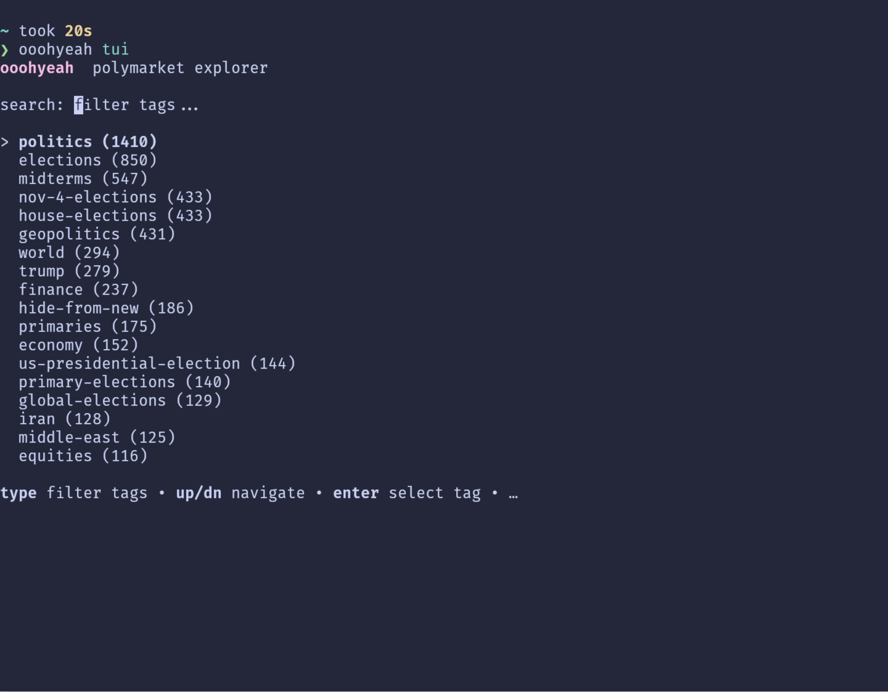
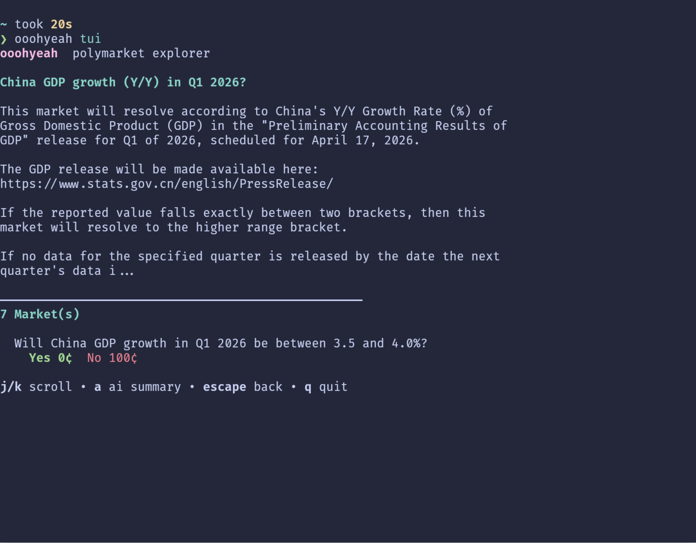

# ooohyeah

A Polymarket summarization tool that uses a language model to extract and summarize information about markets related to a specific topic or question.

> Nothing beats a mix of black magic and good vibes.

## 2 minute pitch

ooohyeah is a terminal-based tool that scrapes live prediction market data from Polymarket, filters out noise like sports and crypto, and lets you explore what the world actually thinks is going to happen — right from your command line. It pulls thousands of active markets and optionally generates AI-powered summaries using Mistral so you can get tweet-length briefings on any event.

The interactive TUI lets you drill down by tags, narrow your search across multiple dimensions, and inspect individual markets with real-time yes/no pricing — all without opening a browser. Think of it as a Bloomberg terminal for prediction markets, built for developers and power users who want signal over noise. 

It's lightweight, runs on Babashka, and turns the firehose of Polymarket into something you can actually reason about in under 30 seconds.

---


---

## Screenshots





---

## Requirements

- `babashka@latest`
- `MISTRAL_API_KEY` as ENV key (optional (se.envrc.example`), for summaries, only Mistral is supported at this point)

### Supported (tested) OS

- Linux (native or WSL)
- macOS

## Local File Storage

All data will be stored under `~/.ooohyeah`.

The cached Polymarket data is stored in `~/.ooohyeah/data/` as `events.json` (raw data) and `formatted_events.json` (preprocessed for the TUI).

## Installation

### Quick Install with bbin (Recommended)

The easiest way to install ooohyeah is to use [bbin](https://github.com/babashka/bbin), a script manager for Babashka:

```sh
# --force to update if already installed
bbin install io.github.simonneutert/ooohyeah --force
```

This will make the `ooohyeah` command available globally on your system.

**Requirements:**
- [bbin](https://github.com/babashka/bbin) installed
- Java/JDK installed (required by bbin for dependency resolution)
- `~/.local/bin` in your PATH (add to your `~/.zshrc` or `~/.bashrc` if needed):
  ```sh
  export PATH="$HOME/.local/bin:$PATH"
  ```

### Containered

I added a Dockerfile you to try. Make sure to pass the needed ENV variables.

There may be issues, I couldn't check it yet 🤓

### Usage

After installation, you can run the tool with:

```sh
ooohyeah cache # to cache Polymarket data locally
ooohyeah tui # to launch the interactive terminal UI
```

Experienced babashka users can also run the tasks in bb.edn after cloning the repository locally.

## Project setup / Development

- `$ cp .envrc.example .envrc` to create a `.envrc` file with the necessary environment variables (e.g., API keys)
- `$ bb prepare` to install the dependencies
- prefill the local events cache with `just cache_polymarket`
- `$ bb tasks`

> Read the `justfile` for more details on the available commands and their usage.
